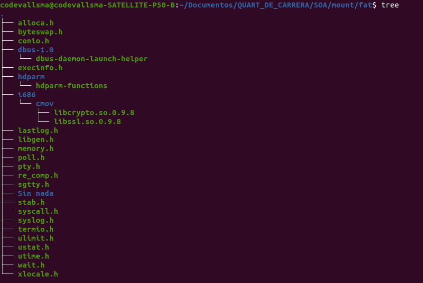
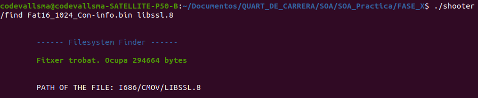

# SOA_Practica

## 1.0 HOW TO COMPILE THE PROJECT
In order to execute the program **run make** on the **FASE_X folder** and execute the command:<br>**./shooter \<operacio\> \<nom_volum\> \<nom_arxiu\>**<br>
<br>The parameters are used as following:

| PARAMETERS    |                 PHASE 1                |                     PHASE 2                |                 PHASE 3                  |                PHASE 4                    |
|----------     |:---------------------------------------:|:------------------------------------------:|:----------------------------------------:|:----------------------------------------:|
| \<operacio\>  | /info                                  |  /find                                     | /find                                    | /delete                                   |
| \<nom_volum\> | The volume name that we want to read   |   Same as Phase 1                          |  Same as Phase 1                         |  Same as Phase 1                          |
| \<nom_arxiu\> | Not available for phase 1              |   File name to be seeked inside the volume |  File name to be seeked inside the volume|  File name to be deleted inside the volume|
<br>

Problems may occur when searching filenames with FAT 16 filenames, because VFAT is not implemented in this project, so the maximum file name characters is 8. 
If the filename we want to search has more than 8 characters we will have to type the first 6th character followed by it's extension.<br><br>
For example, if we want to find libssl.so.0.9.8<br><br>

<br><br>We will have to type: <br><br>

<br><br>As this is a problem with filename sizes in when working with fat16 we will encounter this problem as in phase 2, 3 and 4 with fat16 filesystems.

## 2.0 EXPLANATION ABOUT THE FILESYSTEMS
### 2.1 Ext2 (Second extended filesystem):
* Appears in 1993
* Of the most used in Linux systems
* Information organized in blocks and groups of blocks
* Each file is represented by an inode (index node)


#### 2.1.1 Ext2 (Block group)
* Superblock (1b): In all groups the same information, allows
  error recovery 
* Group descriptors: Group information
* Data block bitmap (1block): 1bit per block: 0 - free, 1 - in use
* Inode bitmap (1block): 1bit per block: 0 - free, 1 - in use
* Inode table: N blocks with the inodes one after the other, the information of
  how many nodes are in a group is in the superblock
* Data blocks: N blocks with the data

####  2.1.2 Ext2 inodes
Information: mode, size, dates, etc.
15 pointers:
* Top 12th pointers point to blocks of information
* 13th pointer points to a group (1 level for get to information)
* 14th pointer points to a group that points to groups (2 levels to reach the information)
* 15th pointer points to a group that points to groups that point to groups (3 levels to get to the information)

####  2.1.3 Ext2 (Directories)
* Each directory is a list of directory entries
* A directory entry associates a filename with an inode
* Directory entry:
    * inode number
    * file name size 
  * file name
* The root directory is always in inode 2, easy to find
* Inode 1 is used to control bad blocks, a hidden file that points to all wrong blocks
* Hard links are one more entry with another name pointing to the same inode
* The directories "." and ".." are two more entries that point to the inode of the current directory and the parent directory 
  and always exist.<br><br>
  
<p align="center">
  
</p>

### 2.2 FAT 16 (File allocation tables):
Designed in 1977 for floppy disks
* Used for hard drives in MSDos and later in windows 9X
* It is still the most used file system today for pendrives, SD cards etc.
* It is also on modern computers, in the UEFI boot system
* Originally designed for 8bits, but there are different extensions, FAT12, FAT16 (this is the one I am implementing in this project), 
  FAT32

#### 2.2.1 FAT16 (Design)
* Uses an indexing table, File allocation table, with pointers to the disk area of each piece of file
* Each entry contains either the number of the next file chunk or a marker of: end, unused space, or 
  reserved space.

#### 2.2.2 FAT Partition Boot Sector
The Partition Boot Sector contains information that the file system uses to access the volume.

#### 2.2.3 FAT Root Folder
The root folder contains an entry for each file and folder on the root. The only difference between the root folder and other folders
is that the root folder is on a specified location on the disk and has a fixed size (512 entries for a hard disk, number of entries
on a floppy disk depends on the size of the disk).

#### 2.2.4 File Allocation System
The file allocation table contains the following types of information about each cluster on the volume:
* Unused (0x0000)
* Cluster in use by a file
* Bad cluster (0xFFF7)
* Last cluster in a file (0xFFF8-0xFFFF)

#### 2.2.5 FAT Folder Structure
Folders have set of 32-byte Folder Entries for each file and subfolder contained in the folder.<br>
The Folder Entry includes the following information:
* Name (eight-plus-three characters)
* Attribute byte (8 bits worth of information, described later in this section)
* Create time (24 bits)
* Create date (16 bits)
* Last access date (16 bits)
* Last modified time (16 bits)
* Last modified date (16 bits)
* Starting cluster number in the file allocation table (16 bits)
* File size (32 bits)

<br>For more information about the FAT16 filesystem click this [useful link](https://www.ntfs.com/fat_systems.htm)

## 3.0 EXPLANATION ABOUT THE PROJECT
### (3.a) REQUIREMENTS

In this repo I tried to read file systems in c, to be exact we will read FAT16 and EXT2 volumnes. I divided the project in 4 phases: <br>
* **Phase 1:**<br> Info: Displays the information of FAT16 and ext2 filesystems<br><br>
* **Phase 2:**<br> Find: Given a file name by parameters the program tries to find the file inside the filesystem root directory and if it
  is found, displays the size in bytes, if not, it displays an error message.<br><br>
* **Phase 3:**<br> Find: Given a file name by parameters the program tries to find the file inside all the filesystem and if it is found,
  displays the size in bytes, if not, it displays an error message. Since fat files can only have 8 bytes,  I only compared the first 6
  characters to compare the file if the filename is larger than 8 characters<br><br>
* **Phase 4:**<br> Delete: Given a filename by parameters, this program searches this file through the desired volume and deletes it from
  the file system<br>
### (3.b) DESIGN (How I designed the project)
The project has been split in three different folders inside the **FASE_X/src** folder :
1. The **FAT16 folder**: <br>This is the folder where I could find the fat header and c files that contained all the functions related with 
   FAT16 filesystem managing. <br><br>
2. The **EXT2 folder**: <br>This is the folder where I could find the fat header and c files that contained all the functions related with
   EXT2 filesystem managing.<br><br>
3. The **Utils folder**: <br>This is the folder where I could find all the functions related with opening files, reading information from 
   file descriptors and displaying information on the screen.<br><br>   
   
### (3.c) USE OF DATA STRUCTURES
#### 3.c.1 Data structures for the ext2 filesystem
This is the inode struct. I tried to avoid it as long as I could because it takes up a lot of memory space in ram, but sometimes is 
very useful when wanting to pass a lot of parameters related with inode information to a function.
```c
struct Ext2_inode {
  __u16 i_mode;         /* File type and access rights */
  __u16 i_uid;          /* Low 16 bits of Owner Uid */
  __u32 i_size;         /* Size in bytes */
  __u32 i_atime;        /* Access time */
  __u32 i_ctime;        /* Creation time */
  __u32 i_mtime;        /* Modification time */
  __u32 i_dtime;        /* Deletion Time */
  __u16 i_gid;          /* Low 16 bits of Group Id */
  __u16 i_links_count;  /* Links count */
  __u32 i_blocks;       /* Blocks count */
  __u32 i_flags;        /* File flags */
  __u32 i_osd1;
  __u32 i_block[EXT2_N_BLOCKS];  /* Pointers to blocks */
  __u32 i_generation;
  __u32 i_file_acl;
  __u32 i_dir_acl;
  __u32 i_faddr;
  __u32 i_osd2[3];
};
```
I used the following data structure when iterating through data blocks to find the file i was looking for. 
I found it useful because it provides a lot of information of the file and, I used all fields. 
```c 
//I used this data structure only when iterating through directories 
struct Ext2_dir_entry {
    __u32 inode;            /* Inode number */
    __u16 rec_len;        /* Directory entry length */
    __u8 name_len;        /* Name length */
    __u8 file_type;
    char name[EXT2_NAME_LENGTH];    /* File name */
};
```

#### 3.c.2 Data structures for the FAT16
The following struct is used when iterating file entries trying to find the file inserted. 
This struct was found on [the internet](https://codeandlife.com/2012/04/02/simple-fat-and-sd-tutorial-part-1/) 
but it had lots of fields, so I reduced the fields to the ones I was sure that we will always use. This struct is used for storing the FAT16 entries.
```c
typedef struct {
    //THE +1 to include the \0
    unsigned char filename[FILENAME_SIZE +1];
    //THE +1 to include the \0
    unsigned char ext[EXTENSION_SIZE+1];
    unsigned char attributes;
    unsigned char reserved[10];
    unsigned short modify_time;
    unsigned short modify_date;
    unsigned short starting_cluster;
    uint file_size;
} __attribute((packed)) Fat16Entry;
```
The next struct is used to scan the information of the FAT16 filesystem. This struct is useful for calculating byte offsets when searching in subdirectories 
and printing the volume information to the screen.
```c
typedef struct {
    uint8_t systName[8];
    uint16_t sectorSize;
    uint8_t sectPerCluster;
    uint16_t BPB_ResvdSecCnt;
    uint8_t numFats;
    uint16_t maxRootEntries;
    uint16_t BPB_FATsz16;
    uint8_t volLabel[11];
    uint16_t totalSectors;
} Fat16BootSector;
```
### (3.d) TESTS PERFORMED.
I used the mount and umount tools in a linux terminal, in order to check if the results obtained, I executed the tree command in order to see all the files inside
both filesystems. **I strongly insist that these tools were used in a command line, just to check the results obtained, and they are not included in any part of the code.**
#### THE EXT2 OUTPUT 
```console
codevallsma@codevallsma:~/SOA$ sudo tree mount/ext2/
    mount/ext2/
    ├── com
    ├── lost+found
    ├── ostia
    │   └── pilotes
    ├── TestFolder
    │   └── SegonNivell
    ├── va
    └── wep
```
#### THE FAT 16 OUTPUT 
```console
codevallsma@codevallsma:~/SOA$ tree mount/fat/
mount/fat/
├── alloca.h
├── byteswap.h
├── conio.h
├── dbus-1.0
│   └── dbus-daemon-launch-helper
├── execinfo.h
├── hdparm
│   └── hdparm-functions
├── i686
│   └── cmov
│       ├── libcrypto.so.0.9.8
│       └── libssl.so.0.9.8
├── lastlog.h
├── libgen.h
├── memory.h
├── poll.h
├── pty.h
├── re_comp.h
├── sgtty.h
├── Sin nada
├── stab.h
├── syscall.h
├── syslog.h
├── termio.h
├── ulimit.h
├── ustat.h
├── utime.h
├── wait.h
└── xlocale.h

5 directories, 24 files
```
In order to check if the files I found were correct, I took a look at this output and if the path of the file and the output of this command and checked if 
they were the same.<br>
To see if i deleted the file successfully from the filesystem, first I deleted the file and unmount the filesystem and mount it again and see if the file is 
still there.<br>
### (3.e) PROBLEMS ENCOUNTERED AND HOW DID I SOLVE THEM
The most of the problems that I faced were not related with the code, they were more about understanding how these two filesystems worked, sure we have documentation 
available for both filesystems, however, I found them hard to understand because of the huge amount of fields a both filesystem have. Once I had understood how they 
worked, the code was not that hard, as it is like reading from a normal file with offsets calculated with some formulas found in the documentation. These filesystems 
have differences in the way they work, but they both use root directories and have directory entries but treated differently. 
The most difficult problems of this project for me were how to access to subdirectories (for both filesystems) and how to delete files with the ext2 format.
<br><br>
One problem that faced that it was related with the code, was when accessing the subdirectories, in the seek file I declared the offset of the directory as 
a ***unsigned short __u16*** instead of ***uint32_t dirOffset***, so I had troubles accessing to subdirectories, because the offset had missing bits and therefore,
it pointed to somewhere that it was not supposed to be pointed at. Once I changed that variable everything worked. <br> <br>
At first I thought that it would take me a lot of time to reformat all the code to be adapted to the *phase 3*, as it had to include the functionality of accessing 
the subdirectories, and I did not know what how it had to be done. It turned out that the code was pretty reusable as the file search could be implemented with a 
recursion approach.<br><br>
### (3.f) TIME DEDICATED.
1. **PHASE** 1: 8H
2. **PHASE 2**: 15H
1. **PHASE 3**: 10H
1. **PHASE 4**: 4H
1. **DOCUMENTATION**: 15h

## 4. Explanation and overall opinion of GIT
Git is an excellent tool for programmers, and it should always be used when developing a project, as it allows you to save the versions of the code that at that 
point worked.
It allows you to have different versions that you know are stable, that's the reason I use branches, because I always want to have versions available that are 
stable but in different levels. The branches are used in this way:
1. **The main branch**: It is used to have *snapshots* of the final versions of the project, that's the reason I always have merged the develop branch when 
   finishing a *Phase*. In this branch I have the production code.<br><br>
2. **The develop branch**: Here is where I merge all the branches when I have a stable feature finished. For example when I finish the feature of the ext2 
   from phase x, I merge the feature branch into here. It is kind of a stable branch that is not ready for production.<br><br>
3. **The feature branch** : In this branch I always commit the code that I tested that it is stable or useful to save for a feature in particular. 
   It is always named as *feature/***name_of_the_feature****. When finishing this feature, I merge this branch into the development one.

## 5. Conclusions
The use of *c* in this project is very appropriate as it is a low level project. This language forces the programmer to think which is the data type is that best fits 
in every situation, and that does not happen with high level language, as memory optimization, and also it's use, is the last thing programmers think of improving.<br>

This filesystems, both fat and ext2, helped me understand how early windows and linux versions worked. Having learned both filesystems, the learning curve will be not 
that steep if i had to learn a new one.<br>

To sum up, I think this project is very useful, not only by the learning of the filesystems used (because they are not that 
used nowadays), but for the knowledge that has provided me.